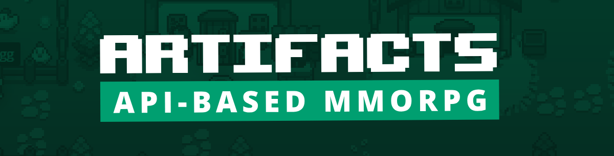

# ⚔️ Go-ArtifactsMMO SDK [WIP]

[](https://github.com/0xN0x/go-artifactsmmo/actions)
[](https://goreportcard.com/report/github.com/0xN0x/go-artifactsmmo)
[](https://codecov.io/gh/0xN0x/go-artifactsmmo)

`go-artifactsmmo` is a Go SDK for interacting with the [**ArtifactsMMO API**](https://artifactsmmo.com/), a unique MMORPG where the entire game is played by programming your own client or bot to control your character. Whether you're a coding newbie or a veteran at handling APIs, this project simplifies communication with the game.

### 🌍 What is ArtifactsMMO?
ArtifactsMMO is a MMORPG where you code your own bot or client to play. Picture an epic quest, but instead of pushing buttons, you're writing code! Manage your character, explore, fight, and interact with the game's universe—all through API calls.

## 🔧 Documentation
- 📚 [Official ArtifactsMMO Docs](https://docs.artifactsmmo.com/)
- 🔍 [GoDocs](https://pkg.go.dev/github.com/0xN0x/go-artifactsmmo)

## 🚀 Installation
Add `go-artifactsmmo` to your project:
```bash
go get github.com/0xN0x/go-artifactsmmo
```

## 📖 Usage
Here's a quick example to get you started:
```go
package main

import (
    "fmt"
    "github.com/0xN0x/go-artifactsmmo"
)

func main() {
    client := artifactsmmo.NewClient("your-api-token", "your-character-name")
    character, err := client.GetCharacterInfo()
    if err != nil {
        fmt.Println("Error:", err)
        return
    }
    fmt.Printf("Welcome, %s (XP: %d/%d)!\n", character.Name, character.Xp, character.MaxXp)
}
```

## ⚙️ Features
- API token authentication

## 📅 Todo 
- [x] API token authentication
- [ ] Continuous Integration
- [ ] Movements
- [ ] Fights management
- [ ] Gathering ressources
- [ ] Tasks (quests) support
- [ ] Inventory
  - [ ] Equipments
  - [ ] Weight
- [ ] Bank
- [ ] Recycling
- [ ] Skills
- [ ] Grand Exchange
- [ ] Events
- [ ] Safe rate limiting
- [ ] Examples
- [ ] Unit test (cov ~> 80%)

## 📚 Examples
- 🎓 [Getting Started](cmd/getting-started)
<!-- - 🎓 [Quick Start Guide](examples/QUICKSTART.md)
- 🛠️ [Advanced Examples](examples/ADVANCED.md) -->

## 🛠️ Work In Progress
This SDK is actively being developed! Expect frequent changes, but we're working hard to deliver a stable experience soon. 🚧

## 💻 Contributing
Contributions are more than welcome! If you have suggestions or patches, feel free to open a PR. Please try to follow Go best practices and aim for 80% or higher test coverage with your changes.

## ❤️ Contributors
- [0xN0x](https://github.com/0xN0x/) - Creator & Maintainer
- [rick-gnous](https://github.com/rick-gnous) - Co-Creator & Maintainer

## ⚖️ License
This project is licensed under the [GPLv3 License](LICENSE).